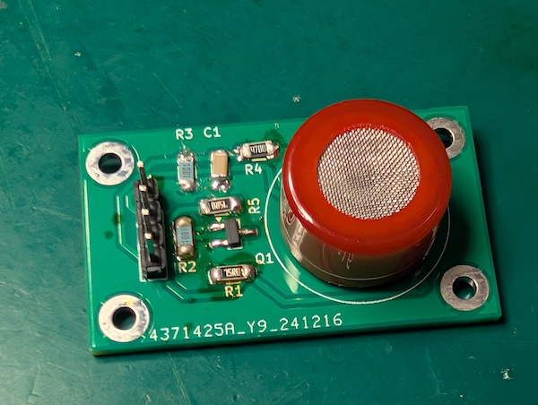
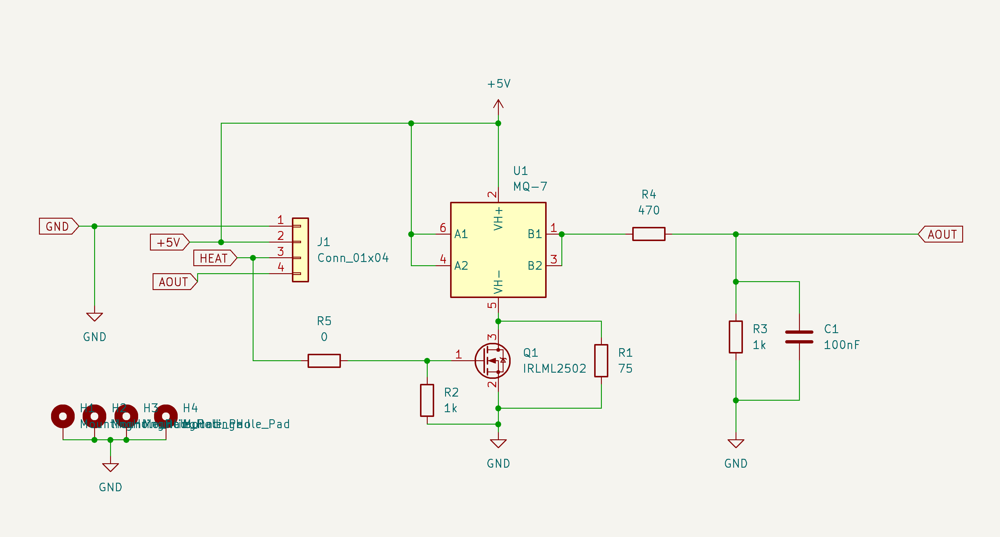

MQ7 Adapter Board
=================

This board implement the circuit proposed by home assistant to enable the
proper cycling of the sensor: https://devices.esphome.io/devices/MQ-7

It provides a cleaner and easier to accomplish (in some regards) solution
compared to modifying the original breakout board. You can also source
the parts without the original board.

This board does not include a power led that is lit when 5V is present
as I did not find that particular useful. 

Notes
=====

There are a few design choices for the board. Some of them them, e.g. 
the selection of R1 also apply if you do the modification on the
original breakout board.

Selection of R1
---------------
The MQ7 and MQ7B require different resistors for R1. The 75Ω used in the 
circuit here will result in 1.5V voltage across the heating element in the 
MQ7 when HEAT input is low, which is the required value for the MQ7B. If 
you are using a MQ7, the voltage should be 1.4V. This requires R1 to be 82Ω
or 86Ω assuming 33Ω for the heater itself.

It should also be possible to leave R1 unpopulated and use PWM with a duty
cycle that is equivalent to 1.4V/1.5V instead and save the 160mW that this
resistor burns but I have not tested that.

Selection of R5
---------------
When going with the original schematics, R5 is 0Ω and just be bridged
by solder.  If you want to play a bit safer and protect the IO pin of
ESP, it is recommended to use something like 100Ω here.

Order of pins
------------
Please note that VCC and GND are reversed in comparison to the common MQ7
breakout board that constantly heats the sensor.

Holes for the MQ7 sensor
------------------------
The holes for the MQ7 are 1mm. This is enough for new sensors. If you 
desoldered an MQ7 sensor, you might need to enlarge the holes a bit to
fit a desoldered sensors or adjust the hole sizes in the project.

Finished board
==============

Schematics
==========

Bill of materials
=================

| Qty | Reference | Value     | Notes                                        |
|----:|-----------|-----------|----------------------------------------------|
|   1 | C1        | 100nF     |                                              |
|   1 | J1        | Conn 1x4  |                                              |
|   1 | Q1        | IRLML2502 | Or other SOT23 N-channel mosfet, e.g. SL2310 |
|   1 | R1        | 75        | or 82Ω/86Ω. See Note on selection of R1      |
|   2 | R2,R3     | 1k        |                                              |
|   1 | R4        | 470       |                                              |
|   1 | R5        | 100       | Or 0Ω See note on R5                         | 
|   1 | U1        | MQ-7      |                                              |

The IRLML2502 transistor is the one that I had on hand and used. The original
modification recommends the SL2310. But any N-Channel mosfet with V_GS < 3.3V
that can handle the ~150 mA should work fine.

License
=======
This project is licensed under the 
[CC BY-SA 4.0](https://creativecommons.org/licenses/by-sa/4.0/) license